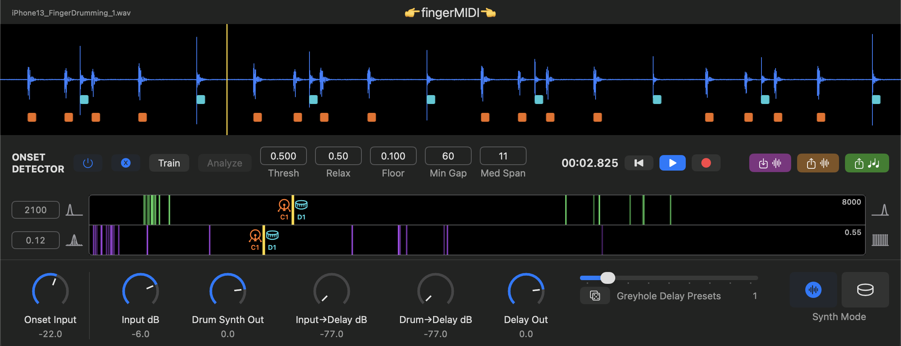

# 👉fingerMIDI👈

**fingerMIDI** is a simple 2-voice audio-to-MIDI finger percussion transcription app for macOS.

The flexibility of MIDI transcription lets you collect rhythmic ideas from your audio recordings, wherever inspiration strikes! 👉📲 🦅🌄 

Specialized for finger percussion, it performs onset detection with spectral centroid and flatness analysis to detect high/snare from low/kick timbres, and map these to MIDI notes.

A MIDI file of your performance can be exported to your DAW of choice where you can finish your music! 🪄💻🔊

For 👽💫, it also includes an Eventide-style [`reverb`](https://faustlibraries.grame.fr/libs/reverbs/#regreyhole) exported from the [`FAUST`](https://faust.grame.fr/) Library (along with basic drum sampler and [`drum synth`](https://faustlibraries.grame.fr/libs/physmodels/#pmdjembe))

The Max RNBO DSP code is made with [`SuperRNBO`](https://github.com/stooby/SuperRNBO) (a library of Max RNBO translations of SuperCollider UGen C++ source).

## [`Demo Video`](https://youtu.be/FEHc_2TVmjQ) 👀

## Quick Start 
1. Import or record an audio file. (**hint**: see the [`/assets`](/assets) folder for test audio files)
2. Enable "Train", play for 5-10+ seconds, and disable "Train" to auto-set the Spectral Centroid/Flatness cutoffs. Or set the cutoffs manually yourself based on the histogram feedback during playback.
  - 💁🏼‍♂️ Hint: For better results, it's recommended to train on material that has two distinct low/kick and high/snare percussion timbres. Distinct timbres need to be heard during training in order for auto-set cutoff values to be meaningful.
3. Adjust onset detection parameters if needed:
  - Decrease 'Onset Input' if there are too many false triggers (or vice versa).
  - Alternatively if there are too many triggers per hit, try increasing 'Min Gap' to enforce more time between them (or decrease if triggers aren't happening quick enough and being skipped).
4. Select "Export MIDI" to generate a MIDI file of the detected onsets.
5. Import the MIDI file into your DAW to finish your music! 🥁 💻 🔊

## Technical Details
- **macOS App**: Swift (SwiftUI, [swift-midi-file](https://github.com/orchetect/swift-midi-file)), Objective-C++ Bridge, RNBO C++
  - Co-authored with Claude Sonnet 4.6, 5, and Opus 4.8
- **Audio DSP**: Developed with Max [`RNBO`](https://rnbo.cycling74.com/), integrating DSP code originally from SuperCollider (with [SuperRNBO](https://github.com/stooby/SuperRNBO/)) and [FAUST](https://faust.grame.fr/)\[[`1`](https://faustlibraries.grame.fr/libs/physmodels/#pmdjembe), [`2`](https://faustlibraries.grame.fr/libs/reverbs/#regreyhole)\], then exported to C++

## Features

### Audio-to-MIDI Transcription
- Real-time onset detection with detailed parameters
- Spectral Centroid + Flatness analysis classifies each onset as "kick" (C1) or "snare" (D1), with independently tunable cutoffs for each:
  - If both Centroid + Flatness values are < cutoff -> "kick" (C1)
  - If both Centroid + Flatness values are >= cutoff -> "snare" (D1)
  - If Centroid + Flatness values conflict, defer to whichever is farthest from its own cutoff (highest confidence) 
- Live spectral histograms show detected centroid/flatness values in relation to the cutoff, allowing you to set the cutoff based on visual feedback
- **Train** mode: calculate Spectral Centroid and Flatness cutoffs based on analyzed input
- **Analyze**: Perform offline analysis of the entire audio file based on the current Onset and Spectral Cutoff settings. (**pro tip**: you can leave **Train** mode enabled during offline analysis to train on the entire audio file faster than realtime).
- MIDI note overlay drawn on the waveform shows onset detections (aqua=kick/C1 | orange=snare/D1)
- Offline **MIDI Export** — transcribe detected onsets to a MIDI File

### Audio I/O
- Import audio files
- Record live audio (from your system audio input device)
- Audio waveform display
- Offline **Audio Export** — bounces the processed audio to a WAV file

### Sound & Processing
- Simple 2-voice drum synth triggered by detected onsets:
  - Voice 1: Drum Sampler (TR-909)
  - Voice 2: Djembe Physical Model ([`djembe`](https://faustlibraries.grame.fr/libs/physmodels/#pmdjembe) from FAUST)
- Feedback delay ([`greyhole`](https://faustlibraries.grame.fr/libs/reverbs/#regreyhole) from FAUST) with selectable presets and a parameter randomizer
- Mixing controls of audio input, drum synth output, and delay signals  

## License

fingerMIDI is available under the [GPLv3 License](LICENSE.txt). The exported RNBO C++ runtime (Cycling '74, MIT — see [`RNBO/rnbo/LICENSE`](fingerMIDI/fingerMIDI/RNBO/rnbo/LICENSE)) and the [`swift-midi-file`](https://github.com/orchetect/swift-midi-file) package (orchetect, MIT) retain their original licenses.

